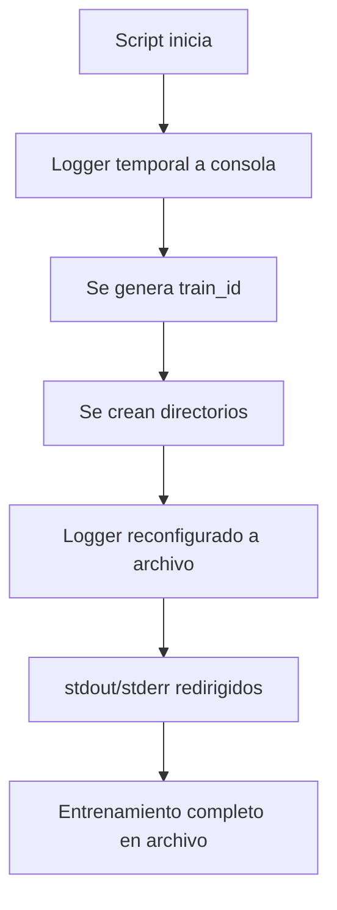

# Sistema de Logging Unificado

## 📋 Resumen

El sistema de logging captura **TODOS** los logs (aplicación + Stable-Baselines3) en un único archivo dentro del directorio de entrenamiento, **sin salida a terminal**.

## 🎯 Características

- ✅ **Logs de la aplicación (AFML)** → archivo
- ✅ **Logs de Stable-Baselines3** → archivo
- ✅ **stdout/stderr (prints, mensajes)** → archivo
- ❌ **Sin salida a terminal** (modo silencioso)

## 📂 Ubicación del archivo de log

```
entrenamientos/{train_id}/training.log
```

**Ejemplo:**
```
entrenamientos/train_BTCUSDT_20230101_20250101_lr3e-4_bs256_ws30_20251004_122706/training.log
```

## 🔄 Flujo de Logging



### Detalle del flujo:

1. **Inicio del script** (`train.py`)
   - Logger configurado temporalmente a consola
   - Mensajes iniciales visibles en terminal

2. **Creación de directorios**
   - Se genera el `train_id`
   - Se crea la estructura de carpetas

3. **Reconfiguración de logging**
   - Logger principal → archivo
   - Logger de SB3 → mismo archivo
   - stdout/stderr → mismo archivo

4. **Entrenamiento**
   - TODO se guarda en `training.log`
   - Terminal completamente silenciosa

## 🛠️ Componentes

### 1. `logger.py` (src/utils/logger.py)

**Funciones principales:**

#### `setup_logger(log_level, log_file)`
Configura el logger principal de la aplicación.
- **Con `log_file=None`**: logs a consola
- **Con `log_file="ruta"`**: logs a archivo únicamente

#### `configure_file_logging(base_dir, log_filename)`
Configura logging a archivo para:
- Logger principal (AFML)
- Logger de Stable-Baselines3

#### `redirect_stdout_to_file(log_file)`
Redirige stdout y stderr al archivo de log.
Captura:
- `print()` statements
- Mensajes de progreso de SB3
- Warnings y errores de librerías

#### `StreamToLogger`
Clase helper que convierte salidas de stdout/stderr en mensajes de logging.

### 2. `train.py`

**Implementación:**

```python
# Inicio temporal (consola)
setup_logger()

# Después de crear directorios
log_file_path = configure_file_logging(self.config.Output.base_dir)
redirect_stdout_to_file(log_file_path)
```

## 📊 Formato de logs

### Logs de la aplicación
```
2025-10-04 12:27:06 - AFML.train - INFO - Inicializando flujo unificado de entrenamiento...
```

### Logs de Stable-Baselines3
```
2025-10-04 12:30:15 - stable_baselines3 - INFO - Using cuda device
```

### Stdout/stderr redirigidos
```
Logging to entrenamientos/train_BTCUSDT_20230101_20250101_lr3e-4_bs256_ws30_20251004_122706/tensorboard/SAC_1
----------------------------------
| rollout/            |          |
|    ep_len_mean      | 100      |
|    ep_rew_mean      | 0.523    |
| time/               |          |
|    fps              | 45       |
----------------------------------
```

## 🔍 Monitoreo del entrenamiento

### Durante el entrenamiento:
```bash
# Ver logs en tiempo real
tail -f entrenamientos/train_BTCUSDT_*/training.log
```

### Buscar errores:
```bash
grep -i "error\|exception\|failed" entrenamientos/train_BTCUSDT_*/training.log
```

### Filtrar logs de SB3:
```bash
grep "stable_baselines3" entrenamientos/train_BTCUSDT_*/training.log
```

## ⚙️ Configuración

### Cambiar nivel de logging

En `train.py`:
```python
setup_logger(log_level=logging.DEBUG)  # Más detallado
```

### Cambiar nombre del archivo de log

En `train.py`:
```python
configure_file_logging(base_dir, log_filename="mi_log.log")
```

### Mantener salida a consola (no recomendado)

Si necesitas ver logs en terminal durante desarrollo:
```python
# Comentar esta línea en train.py
# redirect_stdout_to_file(log_file_path)
```

## 🚨 Troubleshooting

### El archivo de log no se crea
- Verificar permisos de escritura en `entrenamientos/`
- Revisar que `Output.base_dir` esté configurado correctamente

### Logs aparecen en terminal
- Verificar que `redirect_stdout_to_file()` se esté llamando
- Revisar que no haya prints después de la redirección

### Logs de SB3 no aparecen
- Verificar que `verbose=1` o `verbose=2` en la configuración de SAC
- Revisar que `configure_sb3_logger()` se esté ejecutando

## 📝 Notas adicionales

- Los logs se guardan en **modo append** (`'a'`), por lo que múltiples ejecuciones se acumulan
- El encoding es **UTF-8** para soporte de caracteres especiales
- La redirección de stdout/stderr afecta a **todo el proceso Python**
- Los logs persisten después de que el entrenamiento termine
